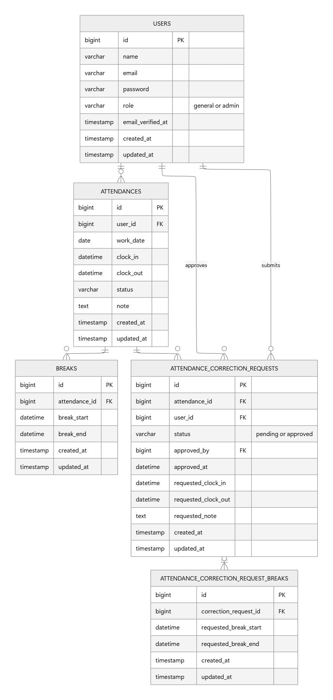

# 勤怠管理アプリ

## 環境構築

### Docker ビルド

- git clone https://github.com/Yuuna-hh/attendance_manager.git
- cd attendance_manager
- docker-compose up -d --build

### Laravel セットアップ

- docker-compose exec php bash

- composer install  
  依存パッケージインストール

- cp .env.example .env  
  .env ファイル作成と以下のように編集

* DB_HOST=mysql
* DB_DATABASE=laravel_db
* DB_USERNAME=laravel_user
* DB_PASSWORD=laravel_pass

- php artisan key:generate  
  アプリケーションキー生成

- php artisan migrate
- php artisan db:seed  
  マイグレーションと初期データ投入

- php artisan storage:link  
  プロフィール画像を表示するため実行
  ※既にリンクが存在する場合はエラーが表示されますが、問題ありません

### トラブルシューティング

#### storage/logs の Permission denied が出る場合

エラー例：  
The stream or file "/var/www/storage/logs/laravel.log" could not be opened in append mode: Failed to open stream: Permission denied

対処：

- docker-compose exec php bash
- chmod -R 777 storage bootstrap/cache

#### SQLSTATE[HY000] [2002] Connection refused が出る場合

エラー例：  
SQLSTATE[HY000] [2002] Connection refused

対処：.env を下記の内容にしているか確認

- DB_CONNECTION=mysql
- DB_HOST=mysql
- DB_PORT=3306
- DB_DATABASE=laravel_db
- DB_USERNAME=laravel_user
- DB_PASSWORD=laravel_pass

改善しない場合：

- docker-compose restart php

#### storage/framework の sessionsフォルダーエラーの場合

エラー例：  
file_put_contents(/var/www/storage/framework/sessions/xxxxxxxxxx): Failed to open stream: No such file or directory

対処：

- docker-compose exec php bash
- mkdir -p storage/framework/sessions
- mkdir -p storage/framework/views
- mkdir -p storage/framework/cache
- chmod -R 777 storage bootstrap/cache

#### キャッシュのクリア（必要に応じて）

- docker-compose exec php bash
- php artisan config:clear
- php artisan cache:clear
- php artisan config:cache

## 機能一覧

- ユーザー認証（一般ユーザー / 管理者）
- メール認証機能
- 勤怠打刻（出勤・休憩・退勤）
- 勤怠一覧 / 詳細表示
- 勤怠修正申請機能
- 管理者による修正申請の承認機能

## URL 一覧（開発環境）

- 会員登録画面（一般ユーザー）：http://localhost/register
- ログイン画面（一般ユーザー）：http://localhost/login
- 出勤登録画面（一般ユーザー）：http://localhost/attendance
- 勤怠一覧画面（一般ユーザー）：http://localhost/attendance/list
- 勤怠詳細画面（一般ユーザー）：http://localhost/attendance/detail/{id}
- 申請一覧画面（一般ユーザー）：http://localhost/stamp_correction_request/list
- ログイン画面（管理者）：http://localhost/admin/login
- 勤怠一覧画面（管理者）：http://localhost/admin/attendance/list
- 勤怠詳細画面（管理者）：http://localhost/admin/attendance/{id}
- スタッフ一覧画面（管理者）：http://localhost/admin/staff/list
- スタッフ別勤怠一覧画面（管理者）：http://localhost/admin/attendance/staff/{id}
- 申請一覧画面（管理者）：http://localhost/stamp_correction_request/list
- 修正申請承認画面（管理者）：http://localhost/stamp_correction_request/approve/{attendance_correct_request_id}

## シーディング情報 / ログイン情報

本アプリでは、動作確認用として以下のユーザーをシーディングしています。あわせて、勤怠データ・休憩データ・修正申請（承認待ち／承認済み）も自動生成されます。

シーディング実行方法
- php artisan migrate:fresh --seed

### 一般ユーザー メールアドレス / パスワード
- general1@test.com / 12345678
- general2@test.com / 12345678
- general3@test.com / 12345678

### 管理者 メールアドレス / パスワード
- admin@test.com / 12345678

## テスト情報

PHPUnitを用いたテストを実装し、合計16ファイル・65項目のFeatureテストを作成しています。
テスト項目の数は要件シートのテストケース一覧に基づいており、すべて成功することを確認しています。

テスト方法

- docker-compose exec php bash
- php artisan test

テスト内容

* 認証機能（一般ユーザー） (RegisterTest.php)
* ログイン認証機能（一般ユーザー） (LoginTest.php)
* ログイン認証機能（管理者） (AdminLoginTest.php)
* 日時取得機能 (AttendanceDateTimeTest.php)
* ステータス確認機能 (AttendanceStatusTest.php)
* 出勤機能 (ClockInTest.php)
* 休憩機能 (BreakTest.php)
* 退勤機能 (ClockOutTest.php)
* 勤怠一覧情報取得機能（一般ユーザー） (AttendanceListTest.php)
* 勤怠詳細情報取得機能（一般ユーザー） (AttendanceDetailTest.php)
* 勤怠詳細情報修正機能（一般ユーザー） (AttendanceCorrectionRequestTest.php)
* 勤怠一覧情報取得機能（管理者） (AdminAttendanceListTest.php)
* 勤怠詳細情報取得・修正機能（管理者） (AdminAttendanceDetailTest.php)
* ユーザー情報取得機能（管理者） (AdminStaffTest.php)
* 勤怠情報修正機能（管理者） (AdminCorrectionRequestTest.php)
* メール認証機能 (EmailVerificationTest.php)

### テスト実行後の注意

本アプリケーションのテストでは RefreshDatabase を使用しているため、テスト実行後はデータベースが初期化されます。
テスト後に動作確認を行う場合は、以下を実行してください。
- docker-compose exec php bash
- php artisan migrate:fresh --seed

## 使用技術（実行環境）

- PHP 8.2.30
- Laravel 12.52.0
- MariaDB 10.x（MySQL互換）
- nginx 1.21.1
- Mailhog

## コーディング規約

本アプリケーションは COACHTECH が定める以下のPHPコーディング規約およびルールに基づいて開発しています。

- https://estra-inc.notion.site/1263a94a2aab4e3ab81bad77db1cf186

## レスポンシブ対応

本アプリケーションは要件に従い、PC・タブレット幅を対象として実装しています。

## ER 図

